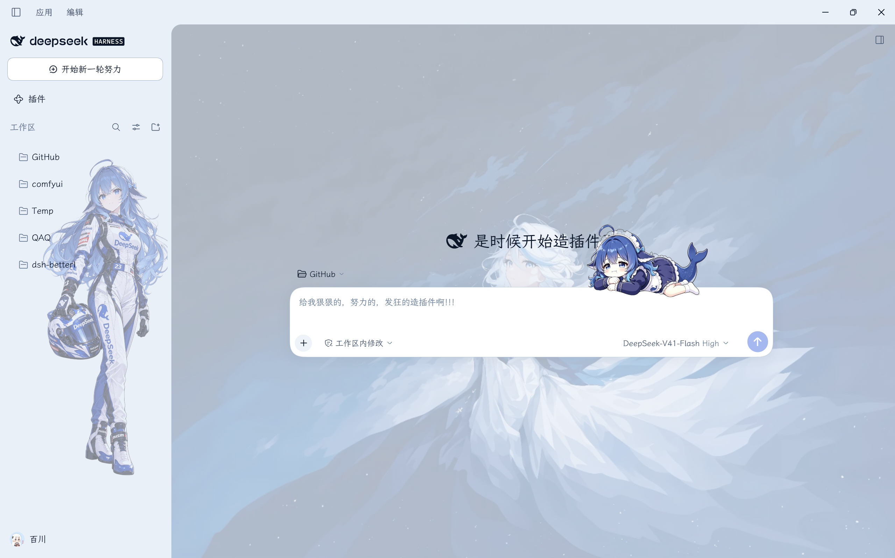
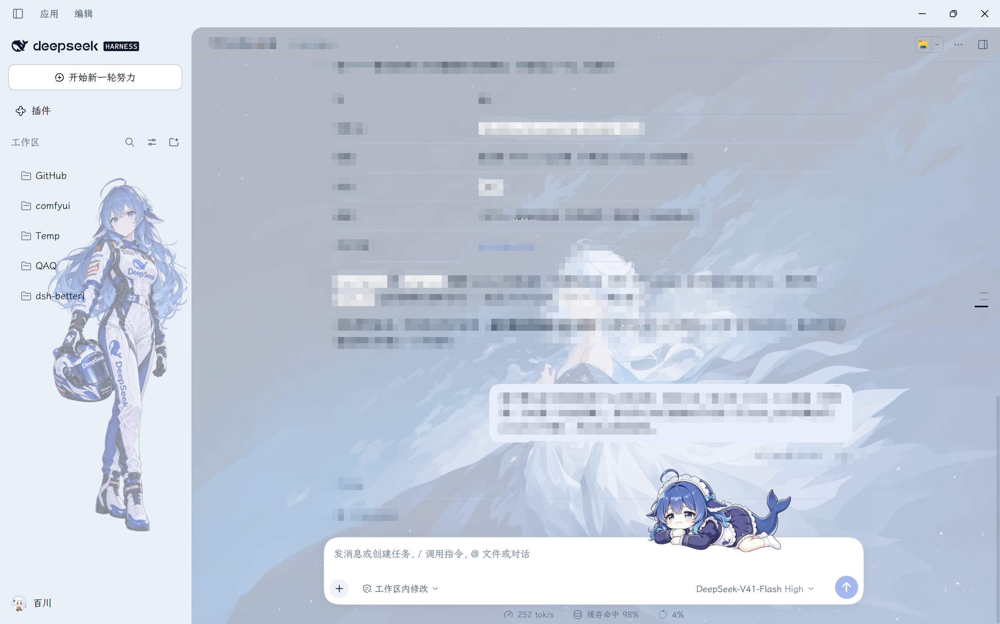
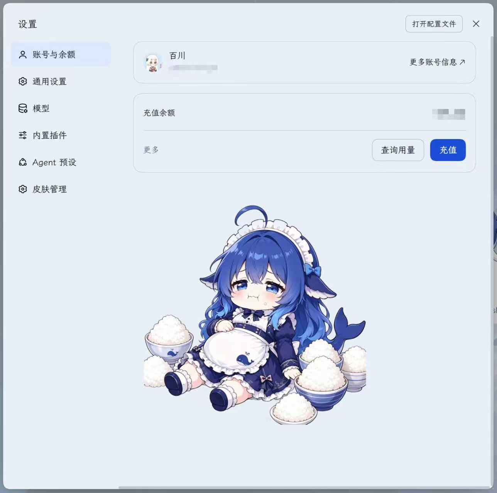
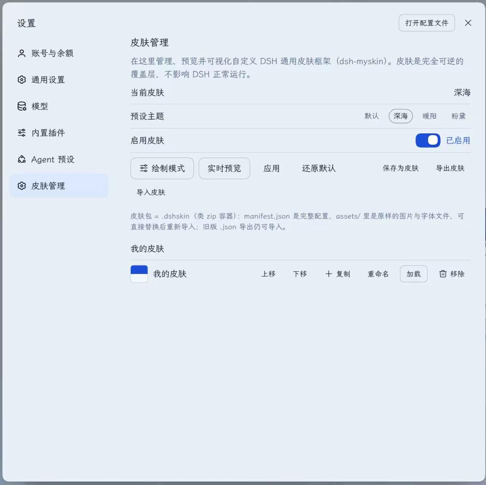
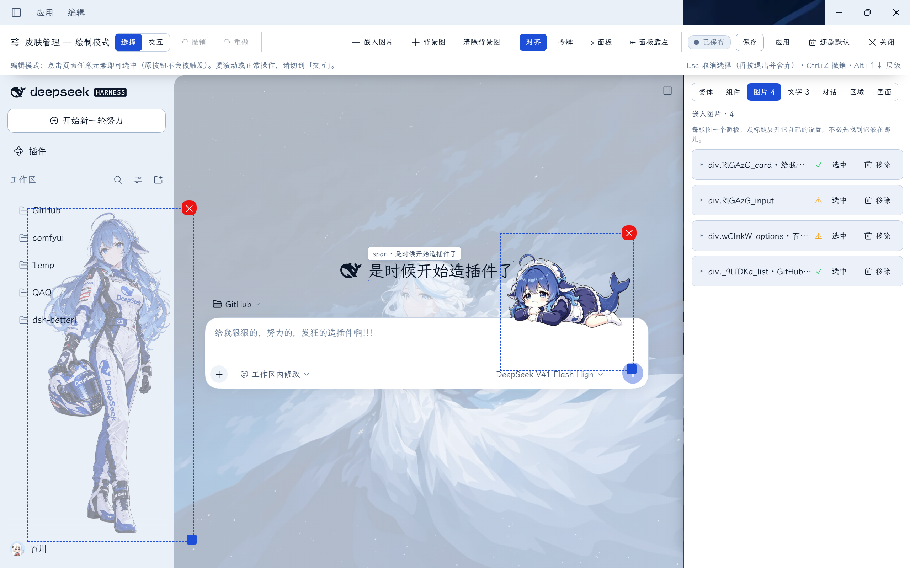

# dsh-myskin (v0.4.0)

**DSH 通用皮肤框架：可视化自定义 + 实时预览 + 「皮肤管理」**，可以随心设计你的专属皮肤，并通过分发皮肤包和你的小伙伴们分享。

Web 与 Desktop 共用同一套客户端插件管线。皮肤是一层完全可逆的覆盖层：不修改 DSH 源码、不触碰 DSH 进程；
关闭开关或点「还原默认」即回到原生外观。

> 适配 DSH **0.1.7-rc.2**、**0.2.0-rc.1**、**0.2.0-rc.2**（Web 与 Desktop）。`npm run check:types` 逐字段对照本机安装的 DSH 校验。

## 目录

- [这是什么](#这是什么)
- [界面预览](#界面预览)
- [0.4.0 要点](#040-要点)
- [能做什么](#能做什么)
- [绘制模式](#绘制模式)
- [皮肤包 .dshskin](#皮肤包-dshskin)
- [安装](#安装)
- [快速上手](#快速上手)
- [数据与持久化](#数据与持久化)
- [让 AI 设计主题（/dsh-myskin）](#让-ai-设计主题dsh-myskin)
- [常见问题](#常见问题)
- [兼容性](#兼容性)
- [许可](#许可)

## 这是什么

- **不侵入**：所有改动写在插件自己的条目里（皮肤文档 + 一个自有 `<style>`），不修改 DSH 的源码、配置与进程。
- **可逆**：每个字段可逐项清除，关闭「启用皮肤」或点「还原默认」即精确还原。
- **可视化**：内置绘制模式，在真实页面上点选元素改样式、改文字、换字体、调位置，边改边看。
- **可搬运**：整套皮肤连同图片与字体打包为 `.dshskin`，换机器或换 profile 一键导入。

## 界面预览

以下截图来自 DSH Desktop（Windows）。示例皮肤在原生外观上做了七处改动：主题色、壁纸、文字替换、字体、移除组件、
在侧边栏嵌入一张 `正片叠底` 混合模式的图片，以及在对话区嵌入一张装饰图。

### 应用效果



*主界面。* 侧边栏的全身立绘与对话区右侧的装饰图都是嵌入图片，问候语与输入框提示文字为文字替换，
整体配色来自预设主题的令牌，背景为壁纸。



*对话界面。* 输入区右侧的装饰图跟随输入区，会话内容与背景保持可读（图中对话内容已由本人打码）。

### 设置页面



*账号与余额页。* 页面上的人物图是按设置页作用域嵌入的图片，只在这一页显示（图中账号信息已打码）。



*皮肤管理页。* 预设主题、启用开关、绘制模式与实时预览入口、皮肤库，以及 `.dshskin` 的导出与导入。

### 绘制模式



*绘制模式。* 顶部为工具条（保存状态、撤销重做、嵌入图片、对齐、面板停靠），右侧为编辑面板；
图中打开的是「图片」页签，列出皮肤里的四张嵌入图（各自带锚点解析状态与选中、移除操作），
画布上同时可见侧边栏与对话区两张嵌入图的选中框与缩放手柄。

### 致谢

截图示例皮肤使用的侧边栏插画由 [@zhangyuzhangyu233](https://github.com/zhangyuzhangyu233) 提供，在此致谢。

- **面板可停靠左右**：面板与页面内缩一起换边，被面板压住的固定定位组件重新可见、可点选。
- **遮挡自诊断**：面板压住其他元素时，工具条报出被压住的对象并提供一键换边。
- **「全站」作用域**：只用元素自身标识写选择器，跨界面改同一个组件，之后新建的实例同样生效。
- **「界面显示」**：按界面控制组件显示或不显示，含三个常用预设与访问过的页面记忆。
- **层级与叠放诊断**：z-index 字段，以及"填了没变化"的三类成因与置顶 / 置底。
- **对话排版**：markdown 的字号行高走令牌、间距走规则，锚点不写构建哈希，compact 变体不受影响。
- **变体**：四个维度加四个整套，点选即可换一整套观感，不需要编写 CSS。
- **图片**：每张图独立面板、层级可选、不可见原因诊断、GIF 保留动画、可选边缘晕染。
- **令牌类改动实时生效**：绘制模式中即时预览，无需先点应用。

逐条变更与取舍见 [CHANGELOG.md](CHANGELOG.md)。

## 能做什么

### 皮肤管理页（设置 →「皮肤管理」）

| 能力 | 说明 |
|---|---|
| 启用 / 停用 | 一键开关整套皮肤，停用即完全还原 |
| 预设主题 | 深海 / 暖阳 / 粉黛，走官方令牌通道，文字对比度经校验 |
| 实时预览 | 不写入文档即可先看效果 |
| 绘制模式 | 在真实页面上可视化编辑 |
| 皮肤库 | 保存、重命名、排序、复制、加载、删除多个命名皮肤 |
| 导出 / 导入 | 皮肤包 `.dshskin` |

## 绘制模式

入口：**设置 →「皮肤管理」→ 绘制模式**。打开后设置弹窗关闭，真实页面内缩，顶部出现工具条，一侧出现面板（默认右侧）。
编辑直接作用于真实页面，不是副本。

### 面板停靠与遮挡

- 工具条的「⇤ 面板靠左 / ⇥ 面板靠右」把面板连同页面内缩整体换到另一侧。
- 页面内缩使用 `body` 的 margin，只影响应用自身的布局；第三方插件若把界面固定在窗口右侧（`position: fixed`），
  不会跟随内缩，从而停在面板下方。换边即可解决。
- 面板压住其他元素时，工具条第二行显示被遮挡的元素名，该行本身即换边按钮。扫描每 1.5 秒一次。

### 选择元素

- **选择**模式：悬停显示虚线框与元素标签，点击选中；**交互**模式：正常使用页面，点击不会误选。
- 面板顶部提供父级 / 子级切换（Alt+↑、Alt+↓），按真实 DOM 逐级移动。
- 快捷键：`Esc` 取消选择（再按退出并保存）、`Ctrl/Cmd+Z` 撤销、`Ctrl/Cmd+Shift+Z` 重做；输入框内不抢占按键。

### 编辑范围

- **仅此元素**：写入该元素的结构选择器。
- **整组**：写入同类元素的公共选择器，侧栏中改一次「工作区行」，所有工作区（含之后新建的）一起生效。
  工作区行（`[role="treeitem"][aria-expanded]`）与对话行（`[role="treeitem"]:not([aria-expanded])`）按 ARIA 语义区分，
  不依赖构建期类哈希。面板显示将写入的选择器与当前命中数量；无法识别同类组时按钮不可用。
  整组时另有**间隔**字段，只调整成员彼此之间的距离，第一个成员与容器顶部的距离不变；成员不是相邻兄弟时该字段不出现并说明原因。
  文字替换始终只作用于当前元素。
- **全站**：以元素自身的标识（生成的类名、共享的 `data-*`、`role`）生成不带祖先路径的选择器，
  适用于在对话、插件页、设置页各渲染一份的组件。画布为命中的每个元素描虚线框，按钮显示命中数量。
  元素没有可复用标识或标识命中过多（超过 64 处，属布局类）时按钮不可用并说明原因。
  只出现在设置页或插件页的元素，可先切到「交互」打开设置弹窗，再切回「选择」进行点选。

### 界面显示

- 「界面显示」卡片按界面逐行控制：设置弹窗一行、当前页面一行，每行可选显示或不显示，右上角标出当前所在界面。
- 写入的规则形如 `body:has(<界面标记>) <组件标识> { display: none !important }`，
  组件标识沿用「全站」的判定，因此"每个界面各渲染一份"与"单一全局节点"两种形态都适用。
  设置弹窗使用 `data-shortcut-modal`；每个页面使用自身的语义标记（插件页 `[data-plugin-panel]`，对话页 `data-conversation-region` 等）。
  注意插件页不是设置弹窗的一页，需要用「本页」那一行单独控制。
- 访问过的页面会被记住（最多 8 个），无需再次切换即可开关。
- 三个常用预设：**只在本页显示**（一条反向规则覆盖所有其他界面，包括尚未打开过的页面；浮层界面额外补一条）、
  **到处都不显示**、**全部恢复显示**。
- 每行的状态同时考虑本界面规则、全局规则与其他界面的反向规则；恢复路径包括「全部恢复显示」、隐藏全部界面时的就地警告，以及回收站。
- 只修改 `display`，同一选择器上的其他声明原样保留，删空即整条消失。
- 不做"某个具体设置页"的匹配：设置导航各页只能靠标签文字区分，按序号或类哈希写在插件增加设置页或 DSH 升级后会隐藏错误的对象。

### 改样式

- 字段分为文字 / 盒子 / 外观 / 位置与缩放 / 元素操作五组，标题带"自定义 N"计数，每个生效字段可单独清除。
- 改动即时预览；隐藏控件（保留占位）与移除控件（不占位）都是纯 CSS，不删除真实节点。
- **回收站**列出被移除的组件，可单项或全部恢复；恢复只删除对应的 `display` 声明。即使移除已保存进皮肤，
  恢复也立即生效——编辑器会量出元素本来的 `display`，在预览层中压过已提交规则，直到下次保存。
- 取值一律走 `--dsw-*` 令牌与真实 CSS，深浅色主题自动跟随。

### 位置与缩放

- X / Y 位移与等比缩放，数值框支持滚轮微调（X/Y ±1px、缩放 ±0.05，按住 Shift 步长放大）。
- 画布上左上角手柄拖动为双轴移动，右下角手柄拖动为等比缩放；每个轴可单独重置，也可一次重置三轴。
- **对齐线**：移动或缩放时与同级元素、父级元素、视口中线在 4px 内吸附并绘制对齐线；按住 Alt 临时关闭，工具条可整体开关。
- **层级（z-index）**：数值输入、滚轮微调、常用值（0 / 10 / 100 / 1000）与独立清除。清空字段即从规则中删除该属性。
  填写后无变化时，字段下方说明属于哪一类原因：元素未定位（提供「设为 relative」）、祖先形成层叠上下文天花板（指明祖先与原因）、
  没有重叠元素（此时改数字不应有变化）。诊断同时列出真实竞争者的层级，并给出「置顶（max+1）」「置底（min-1）」。
- 只做视觉位移与缩放，不改变布局流；归零即删除 `transform`。
- 拖动期间只改写 `transform`，元素上的宽高、内边距、字号等自定义保持原样；面板数字为只读镜像。
  草稿样式表始终排在已提交样式表之后，保存后继续拖动不会被旧坐标覆盖。

### 文字与字体

- **编辑文字**：自动定位承载文字的节点（含灰色默认占位文字），边输入边预览，回车或点击写入草稿。
- **字体**：可填任意字体栈或从建议列表选择（PingFang SC、Microsoft YaHei、Noto Sans CJK SC、HarmonyOS Sans、JetBrains Mono 等）。
- **本机字体列表**：读取本机已安装字体，可搜索、点击即应用，每项以自身字体渲染。
  Chromium 内核使用 Local Font Access API（首次需要授权）；不可用时退化为候选字体探测。列表顶部标明来源。
- **嵌入字体**：`.woff2/.woff/.ttf/.otf`（上限 30 MB）随皮肤保存；超过 2 MB 时提示代价。
- **整站字体（界面 / 正文 / 代码）**：三行独立，可各自清除。界面走 `--dsw-font-family`；
  正文覆盖对话内容与 markdown（不写 `!important`，段落中的行内代码仍使用代码字体）；代码走 `--ds-font-family-code`。
  每行提供「本机」按钮，写入时附带同类兜底字体。

### 区域外观

- 「区域」页签把整个面作为对象调整：对话区、侧边栏、输入框、设置页、消息列表。
  每个区域可设背景色、圆角、阴影、背景模糊、边框（色 / 宽 / 是否显示）、内边距、间距、不透明度。
- 锚点使用类名语义半截（`[class*="_sidebarCol"]`）或 DSH 自身的 `data-*` 钩子（输入框 `[data-composer-card]`、
  设置页 `[data-shortcut-modal]`、消息列表 `[data-conversation-content]`），不写构建哈希。
- 三个整套预设：玻璃（半透明 + 背景模糊 + 大圆角 + 轻阴影）、纸片（不透明 + 中圆角 + 中阴影）、极简（只留圆角）。
  预设描述整套观感，未提到的字段会被清空，不保留上一次的残留。
- 每个区域一条规则（多字段合并），取值从文档读回，卡片顶部显示本页命中元素数量；锚点失配时明确提示。

### 对话排版（Markdown）

- 「对话」页签管理 DSH 生成出来的 markdown。锚点为渲染器自身的根元素（`[class*="_markdown"]`，取类名语义半截），
  并通过 `:not([data-markdown-variant="compact"])` 排除工具预览与折叠思考的 compact 变体。
- **类型走令牌**：正文字号与行高、H1–H4 字号、行内代码与代码块字号、行内代码与代码块底色、链接色，
  写入 DSH 的 `--dsw-font-markdown-*` 分量令牌，字号、行高、字重一起变化。
- **间距走规则**：正文与列表间距、标题上下间距与字重、列表条目间距与标记色、引用边框与底色、行内代码内边距与圆角、
  代码块背景与内边距、表格边框与表头、链接字重、分隔线与图片。
- 紧凑 / 标准 / 宽松三个密度预设；恢复默认只删除本卡片写入的内容，手写规则与其他令牌不受影响。
- 范围可选全部 markdown 输出或仅对话正文（`data-conversation-content` 内）。
- 令牌类改动在绘制模式中即时预览；空字段以灰字显示本页当前生效值（读取 CSS 变量的计算值）。
- 卡片顶部显示本页 markdown 命中数，锚点失配时显示 0。

### 变体

- 「变体」页签位于面板首位，是唯一不需要 CSS 知识的入口。
- 四个维度：卡片材质（玻璃 / 纸片 / 描边 / 无框）、圆角（直角 / 小 / 中 / 大 / 胶囊）、
  密度（紧凑 / 标准 / 宽松）、强调色（跟随主题 / 蓝 / 紫 / 青 / 粉）。
- 四个整套：玻璃通透、纸片清爽、极简安静、张扬。
- 每个选项幂等地写入它拥有的全部属性，切换不残留；写入的是区域规则、排版令牌与品牌令牌。
- 「变体」与「区域」「对话」写的是同一批属性，后改的覆盖先改的。

### 面板页签

- 编辑面板分为七个页签：变体、组件（元素 Inspector 与回收站）、图片、文字、对话、区域、画面（壁纸与令牌）。
- 画布上的选择会自动切换到对应页签；页签状态记录在浏览器本地。

### 画面

- **背景图与背景强度**：强度滑块拖动即时预览，松手自动保存。可选项「壁纸跟随对话区」让对话列锚定自身的框，
  侧边栏展开或收起时自动重新居中（纯 CSS，无脚本）；侧边栏仍使用整页那一份，两侧取景因此不同。
- **嵌入图片**：先选中容器再选图，可拖动、缩放、调整不透明度与混合模式。
  - **边缘晕染**：每张图可设晕染宽度（0–200px）与柔化（边缘过渡曲线 0–100，不做模糊）。
    几何为向外晕出宽度的 1/4、向内吃掉 1 倍宽度，图片不发生位移。
  - **层级**：可选自动 / 内容之下 / 内容之上。自动由混合模式决定；设置页这类子元素不透明的容器中，
    "内容之下"会被内容盖住，改为"内容之上"即可。
  - **不可见诊断**：锚点解析不到、按设置页作用域收起、被容器内容盖住、被容器裁剪，四种成因分开报。
  - **GIF 动图**：按字节识别，按原始字节嵌入、不重编码，动画完整；超出约 3 MB 预算时退回静止图并提示只保留第一帧。
    新嵌入的图片按自身比例放入 320×240，小图不放大。
  - **每张图一个面板**：标题行为宿主 + 解析状态 + 选中 / 移除，展开后是该图自己的设置（锚点、「选中容器」、呈现方式、
    不透明度、混合模式、位置与大小）。展开即选中，画布上选中也会自动展开。
  - **图片选中与组件选中互斥**：选中图片时页面只保留这一个框，面板顶部切换为图片头卡；Esc 依次退出图片、组件、编辑器。
    元素选中仍然保留为锚定操作的对象。
  - **两种呈现方式**：组件嵌入画在组件内部（在组件背景之上、内容之下，随组件被裁剪）；
    组件锚定画在组件之外的独立图层（不吃点击，可超出组件范围，不修改宿主元素的定位与裁剪）。
  - **锚点**：元素（结构选择器，默认）、文字（跟随该段文案）、内置组件（整个应用、应用外框、对话主列、会话内容区、
    输入区、输入框、新对话占位文字、工作区会话树）。锚点暂时找不到时图片保持不动并等待页面回来，面板显示解析状态。
    改锚点即时生效。整组范围下锚点为整组，一张图贴到同类的每个元素上，之后新建的成员自动包含。
- **令牌**面板：按背景、边框、品牌色、文字、按钮、交互分组，逐项覆盖 `--dsw-*`。
- 工具条可收起面板查看整页，也可将面板停靠到左侧；面板、工具条与选中框均为插件自有层，退出即消失。

### 保存、应用与退出

| 按钮 | 行为 |
|---|---|
| **保存** | 写入皮肤文档并留在绘制模式继续编辑，不改变皮肤的启用状态 |
| **应用** | 写入并启用，然后退出绘制模式 |
| **✕ 关闭** | 直接关闭并放弃未保存的改动（页面回到皮肤文档的状态）；第二次 Esc 同义 |

## 皮肤包 .dshskin

「导出皮肤」产出标准 ZIP（任何解压工具均可打开），配置与素材分开存放：

| 条目 | 内容 |
|---|---|
| `manifest.json` | 完整配置：令牌、CSS、文字替换、画布、图层、皮肤库，以及格式版本、生成器、时间戳与资源清单 |
| `assets/…` | 原始图片与字体文件（不是 base64） |
| `README.txt` | 包内说明 |

- **体积**：素材以二进制存放。一份实测主题由 351 KB 的 JSON 变为 141 KB 的皮肤包。
- **可替换素材**：解开包，替换 `assets/` 中的同名同格式文件，重新打包即可导入。
- **兼容**：旧版 `.json` 导出仍可导入；包内资源缺失或损坏会明确报错，不会导入不完整的皮肤。

## 安装

> 本插件是 **profile bundle**（包内自带 `cordis.patch.yml`，声明条目 `dsh-myskin`），安装即"放入某个 profile 的
> `node_modules` 并在该 profile 的 `dsh.profile.bundles` 中声明一次"。

### 使用 DSH 内置的「添加插件」

打开 **设置 → 插件（Plugins）→ 添加插件**，填入下列任意一种地址，选择安装源后点「安装」：

| 输入 | 例子 | 说明 |
|---|---|---|
| GitHub 仓库地址 | `https://github.com/WTStarMark/dsh-myskin` | 走 git 安装；也可写 `github:WTStarMark/dsh-myskin`，需要固定版本时加 `#v0.4.0` |
| npm 包名 | `dsh-myskin` | 走所选安装源（`registry.npmmirror.com` 为中国大陆镜像） |
| 本地目录路径 | `~/dsh-plugins/dsh-myskin-0.4.0` | 等价于 `link:`，修改源码即时生效 |

- 安装源只影响 npm 包；填入 GitHub 地址时走 git，不受其影响。
- 安装由 pnpm 执行，机器上需要有 pnpm。
- 安装完成后插件管理器会自动把 `dsh-myskin` 写入当前 profile 的 `dsh.profile.bundles`，不需要手动改配置。
- 界面会提示：插件暂不支持自动更新。升级时先在插件页卸载，再安装新版本。
- 只为桌面端安装时，在桌面版中对同一地址再安装一次（Web 与 Desktop 是两个 profile，皮肤文档各自独立）。

### 验证安装

1. **设置**中出现 **「皮肤管理」**。
2. 仅用命令行确认宿主半区（`<pkg>` 为实际安装目录）：

   ```bash
   node --input-type=module -e "const m = await import('<pkg>/lib/index.js'); console.log(Object.keys(m))"
   # 期望输出：[ 'Config', 'apply', 'name' ]
   ```

### 注册随包技能（可选）

插件包内自带 `skills/dsh-myskin/SKILL.md`，说明皮肤文档的字段与语义、绘制模式的各项契约、`.dshskin` 的读写格式与可逆性要求。
注册后助手在讨论、编写或排查皮肤时会自动加载：

```bash
DSH_HOME="${DSH_HOME:-$HOME/.dsh}"
ln -sfn /path/to/dsh-myskin/skills/dsh-myskin "$DSH_HOME/skills/dsh-myskin"
```

技能是目录包（`$DSH_HOME/skills/<名字>/SKILL.md`，frontmatter 含 `name` / `description` / `whenToUse`），
由 `skill-filesystem` 提供者扫描并热监听，建立链接后不需要重启。删除该链接即注销，不影响插件本身。

### 卸载与回滚

- 在插件页对该插件选「卸载」，它同时会从 `dsh.profile.bundles` 移除条目。卸载后刷新页面（改过 schema 的版本再重启一次 DSH）。
- 皮肤文档仍保留在该 profile 的 `cordis.patch.yml` 中；需要彻底清理时先「导出皮肤」备份，再删除该条目。

## 快速上手

1. **设置 →「皮肤管理」**：选择一个预设主题，点「应用」。
2. 点「绘制模式」：在真实页面上点选元素，修改颜色或字号，或使用「编辑文字」直接改文案。
3. **保存**（继续调整）或 **应用**（写入并退出）。
4. **导出皮肤**得到 `.dshskin` 备份，换机器或换 profile 时导入即可。

## 数据与持久化

- 皮肤文档保存在该 profile 的 `cordis.patch.yml`（插件条目 `dsh-myskin` 的 `config`）。
- 文档随 profile 走，Web 与 Desktop 的皮肤互不共享，使用 `.dshskin` 搬运。
- 皮肤库可保存多套命名皮肤，随时切换。
- 关闭「启用皮肤」即完全还原页面，文档仍保留。

## 让 AI 设计主题（`/dsh-myskin`）

在输入框输入 `/dsh-myskin` 即开始一次主题设计：宿主插件把一段引导交给助手，助手据此加载随包技能、确认偏好、给出方案并落地。

| 输入 | 结果 |
|---|---|
| `/dsh-myskin` | 先询问四项偏好（明暗、主色或氛围、字体、是否需要图片），再给出 1–2 套方案 |
| `/dsh-myskin 深色 + 青色，界面用等宽字体` | 按给定方向直接进入方案设计 |
| `/dsh-myskin 做成浅色纸质，正文要衬线` | 同上，方案写到令牌级（背景、表面、边框、文字档位、品牌色） |

交付内容包括：使用的令牌与规则、对比度校验结果（正文 ≥ 4.5:1 等底线）、还原方式、导出 `.dshskin` 备份的方法。
落地方式有两种：由助手生成 `.dshskin` 后在「皮肤管理 → 导入皮肤」中选择，或给出可粘贴的清单手动填写。

> 助手不会直接修改 profile 配置：皮肤文档存放在其中，属于只读范围；所有改动都由你在界面中确认。

**前提**：该命令在 0.3.9 加入宿主半区，升级到该版本或更高需要重启一次 DSH 才会出现在 `/` 菜单中；仅样式与预设的升级不需要重启。
另需注册随包技能（见上节）。

## 常见问题

**Q：启动时报 `dsh-myskin (dsh-myskin): failed to import`？**

该信息由 DSH 启动器在 Loader 未取得 fiber 时记录，真实异常被吞掉。按顺序排查：

1. 目录名与位置是否正确：必须是 `$PROFILE/node_modules/dsh-myskin`，其中应能看到 `lib/index.js` 与 `cordis.patch.yml`；
2. 宿主半区能否独立导入：`node --input-type=module -e "await import('<pkg>/lib/index.js')"`，能打印 `Config,apply,name` 即正常
   （`lib/index.js` 自带依赖，解压、拷贝、软链三种装法都不需要 `node_modules`）；
3. 该 profile 的 `dsh.profile.bundles` 中是否写入了 `dsh-myskin`；
4. 仍不生效则重启 DSH。

**Q：点「应用」提示保存失败？**

多为文档过大。壁纸与嵌入图会按最长边自动压缩，嵌入字体按原样保存：超过 2 MB 会明显拖慢每次保存，过大时可能被拒绝。
建议整站字体使用系统字体名，或使用子集化后的 `.woff2`。

**Q：提示「保存失败：canvas」？**

该提示表示画布字段被宿主拒绝（`css` 通常同时写入成功）。最常见原因是宿主 schema 比客户端旧，即安装了新版本但未重启 DSH：
客户端已写入新字段（例如锚点类型 `group`），运行中的宿主仍按旧 schema 校验，从而拒绝整个 `canvas` 字段。两种处理方式：
① 重启 DSH 后刷新页面（重启会结束当前会话）；② 先不改该设置，把相关图片的锚点从「整组」改回「元素」再保存。
若画布数据确实很大（面板会显示约多少 KB），则属于体积问题，改用更小的图片。

**Q：装了新版本需要重启 DSH 吗？**

宿主半区（`lib/index.js`，负责 schema 与设置落盘）的变更需要重启；客户端半区（`lib/client.js`）在本机为热更新，
刷新页面即可。因此：只改样式、预设与绘制模式的版本只需刷新页面；改动字段 schema 的版本需要重启 DSH。

**Q：预设主题会不会让文字看不清？**

不会。三套预设的文字档位都按其实际所在背景计算过对比度：正文与次级 ≥ 4.5:1（WCAG AA）、三级 ≥ 3:1、
caption ≥ 2.6、dimmed ≥ 2.2；主按钮与对比按钮的文字同其填充色 ≥ 4.5；品牌色在主背景上 ≥ 3。
这些底线由 `tests/preset-contrast.test.mjs` 校验。三套预设均跟随应用的明暗模式，各自配色完整。
回到原生外观可使用「默认」或关闭「启用皮肤」。旧版内置的「极夜」（强制两种模式都为深色）已移除，
但使用它的令牌保存过的皮肤照常生效（文档保存的是令牌值，界面显示为「自定义皮肤」）。

**Q：点了「本机字体」弹出授权或列表很短？**

Chromium 内核使用 Local Font Access API 枚举本机字体，首次需要授权；拒绝授权或浏览器不支持该接口时，
自动退化为候选字体探测，列表顶部会标明来源。授权可在浏览器的网站设置中修改，刷新页面后重新点击按钮即可。

**Q：改了没效果？**

确认「启用皮肤」已打开；确认当前 profile（Web 中修改的内容不会出现在 Desktop）；可先用「实时预览」确认改动本身有效。

**Q：绘制模式里设置弹窗位置异常？**

绘制模式下真实页面会内缩，设置弹窗遵守同一条内缩规则，因此它居中于应用区域内，而不是被工具条或面板遮挡。

**Q：某个插件的面板被绘制模式挡住，无法操作？**

点击工具条的「⇤ 面板靠左」或「⇥ 面板靠右」：页面内缩与面板一起换边，被压住的组件随即可见。
被压住时工具条第二行会显示被遮挡的元素名，该行本身即换边按钮。

**Q：如何恢复原生外观？**

「皮肤管理 → 还原默认」清空整套皮肤，或关闭「启用皮肤」。两者都不影响 DSH 自身。

## 兼容性

| 项目 | 状态 |
|---|---|
| DSH `0.2.0-rc.2` | 已适配 |
| DSH `0.2.0-rc.1` | 已适配 |
| DSH `0.1.7-rc.2` | 已适配 |
| 平台 | DSH Web 与 DSH Desktop（Windows / macOS / Linux 的桌面壳同理） |
| DSH `< 0.1.7` | 不支持（0.1.7 起才有本包使用的 `Config` 与 profile bundle 形态） |

## 许可

MIT © WTStarMark · 仓库：<https://github.com/WTStarMark/dsh-myskin>
